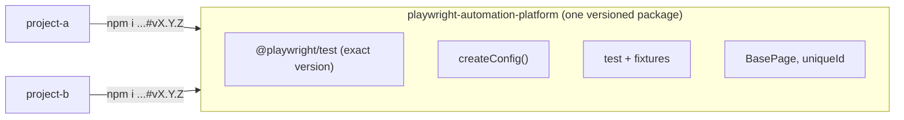

# Playwright Automation Platform

[](https://github.com/tyson1403/playwright-automation-platform/actions/workflows/ci.yml)
[](LICENSE)

A shared **Playwright test platform in TypeScript**. It owns the Playwright version, the base
configuration and the reusable test building blocks in **one repository**. Test projects install it as a
dependency instead of each carrying their own copy of the setup.

## Why

| Without a platform | With this platform |
|---|---|
| Every project pins its own Playwright version | One pinned version, upgraded once |
| `playwright.config.ts` copied and drifting | One `createConfig()` with shared defaults |
| Fixtures and helpers duplicated across repos | Reusable fixtures, page-object base and utilities, imported |
| Cross-browser coverage decided per project | Fast Chromium locally, all browsers in CI, by default |



## Quick start

Install a released version (needs Node 22+ and git):

```bash
npm i github:tyson1403/playwright-automation-platform#v0.5.0
npx playwright install
```

The platform provides `@playwright/test`, so your project does not list it.

```ts
// playwright.config.ts
import { createConfig } from "@tyson1403/playwright-automation-platform";

export default createConfig({
  testDir: "./tests",
  use: { baseURL: "https://your-app.example" },
});
```

```ts
// tests/home.spec.ts
import { expect, test } from "@tyson1403/playwright-automation-platform";

test("home page loads", async ({ page }) => {
  await page.goto("/");
  await expect(page.getByText("Welcome")).toBeVisible();
});
```

> npm may print an "install-scripts" notice during install. The platform builds itself on install
> (`prepare`), which is expected.

## What it provides

| Export | What it does |
|---|---|
| `createConfig(overrides)` | Returns a Playwright config with the shared defaults below. Anything you pass wins; `use` is merged, so your `use` values do not wipe the platform's. |
| `test`, `expect` | Playwright's, with an auto `pageErrors` fixture: a test fails if the page throws an uncaught error. Extend `test` with your own fixtures. |
| `BasePage` | Base class for page objects (`path`, `open()`, `title()`). |
| `uniqueId(prefix)` | Unique, readable test data, e.g. `todo-3f9c1a7e`. |

### Defaults in `createConfig`

| Setting | Locally | In CI (`CI` set) |
|---|---|---|
| Browsers | Chromium | Chromium, Firefox, WebKit |
| Retries | 0 | 2 |
| `forbidOnly` | off | on |
| Reporters | list + HTML | list + HTML |
| Trace | on first retry | on first retry |

Set `ALL_BROWSERS=1` to run all three browsers locally. `baseURL` is intentionally **not** a default:
each project owns its URL. Other nested options (for example `projects` or `expect`) are replaced whole
when you pass them.

### Extending with project fixtures and page objects

```ts
import { BasePage, test as base } from "@tyson1403/playwright-automation-platform";

class TodoPage extends BasePage {
  readonly path = "/todomvc";
}

export const test = base.extend<{ todoPage: TodoPage }>({
  todoPage: async ({ page }, use) => {
    const todoPage = new TodoPage(page);
    await todoPage.open();
    await use(todoPage);
  },
});
```

Complete, runnable versions live in [examples/](examples).

## Versioning and upgrades

Playwright is pinned to an **exact** version in the platform, and releases follow
[SemVer](https://semver.org/) as git tags. Projects pin a platform tag; upgrading Playwright for every
project is one change in the platform plus one line per project. See
[docs/UPGRADING.md](docs/UPGRADING.md) and the [changelog](CHANGELOG.md).

## Quality gates

Every push and pull request runs in GitHub Actions:

- Lint (Biome) and unit tests for `createConfig` and the helpers, on Node 22 and 24.
- Both example projects, in Chromium, Firefox and WebKit, against the platform build from the branch.
- A check that each example runs exactly the Playwright version the platform pins.

## Design decisions

- **TypeScript + ESM** (`NodeNext`), built to `dist/` with type declarations.
- **The repo root is the package**: npm cannot install a subfolder from a git URL.
- **Git tags, not a registry**: no publishing account is needed, and projects pin an exact tag.
- **Projects import `test` and `expect` from the platform**, so they never need a Playwright dependency of
  their own and cannot end up with two copies.

The full decision log and roadmap are in [ROADMAP.md](ROADMAP.md).

## Repository layout

```
src/                  platform source (config factory, fixtures, page-object base, utilities)
test/                 unit tests for the platform
examples/project-a/   consumer: config, API, mocked-network and guardrail tests
examples/project-b/   consumer: page-object tests against the public TodoMVC demo
docs/                 upgrade guide
.github/workflows/    CI
```

## Develop

```bash
npm install
npm run lint        # Biome
npm test            # build + unit tests

# run an example against your local checkout
cd examples/project-a
npm install --no-save ../..
npx playwright install chromium
npx playwright test
```

## License

[MIT](LICENSE)
